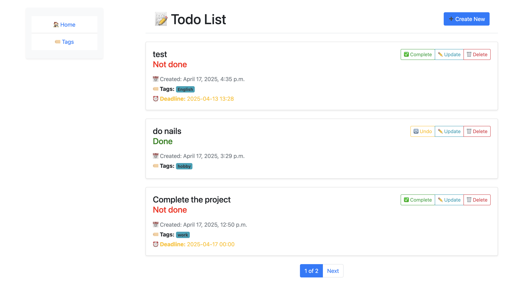

# Todo-list

**Todo list** A simple Django-based Todo List application that helps you manage
tasks effectively. You can create, update, delete tasks, set deadlines, assign 
tags, and mark them as complete or undo their status.

## Features
+ **Create, update, delete tasks**
 
+ **Add optional deadlines to tasks**

+ **Mark tasks as done / undo status**

+ **Assign multiple tags to a task**

+ **Tasks are ordered by creation time and status**

+ **User-friendly interface with Bootstrap 5**

+ **Pagination for better content navigation**

## Technologies Used
+ **Backend:** Python, Django
+ **Frontend:** HTML5, CSS3
+ **Database:** SQLite3


## Setup
1. Clone the repository:
```
git clone https://github.com/juliazelena/todo-list
```
2. Create a virtual environment and install dependencies:
```
python -m venv venv
source venv/bin/activate  # For Windows: venv\Scripts\activate
pip install -r requirements.txt
```
3. Set up the database:
```
python manage.py makemigrations
python manage.py migrate
```
4. Create a superuser for admin access:
```
python manage.py createsuperuser
```
5. Run the development server:
```
python manage.py runserver
```
6. Open your browser and navigate to http://127.0.0.1:8000

## Screenshots

